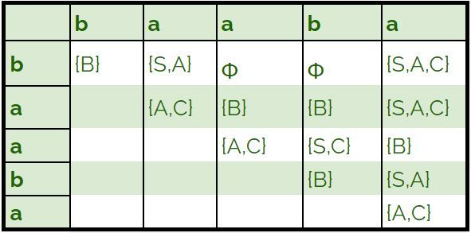

# Proyecto2-Gramaticas

## Estructura para gramáticas
- % significa epsilom como el proyecto anterior
```
CFG: {
	"V": ["S","A","B"...],      // Variables
    "T": ["a","b","c"..."%"],   // Símbolos terminales
    "S":"S",                    // Variabl inicial
    "P": {                      // Producciones
        "S": ["A"],         // S -> A
        "A": ["Aa","a"],    // A -> Aa|a
        "B": ["%","b"],     // B -> ε|b
        ...
    }
}
```
## Algoritmo CYK
- El archivo cyk.py contiene el agoritmo cyk implementado. Para usarlo tienes que importar el archivo y llamar a la función cyk_main()

- Parámetros de cyk_main:
  - CNF: un diccionario que tiene una gramatica en la forma normal de chomsky
  - w: la cadena a validar

  
- cyk devuelve una tupla que contiene dos valores, en la posición 0 la validez, y en la posición 1 la matriz.
  - validez: valor booleano que indica si la cadena puede ser construida con la gramática
  - matriz: devuelve la matriz de transiciones como una lista de listas.
 

Como se ve en el código:
 
```
[ 
    [[B], [S,A], [], [],[S,A,C]],
    [[], [A,C], [B], [B],[S,A,C]],
    [[], [], [A,C],[S,C],[B]],
    [[],[],[],[B],[S,A]],
    [[],[],[],[],[A,C]]
]
```

Lo que representa:
